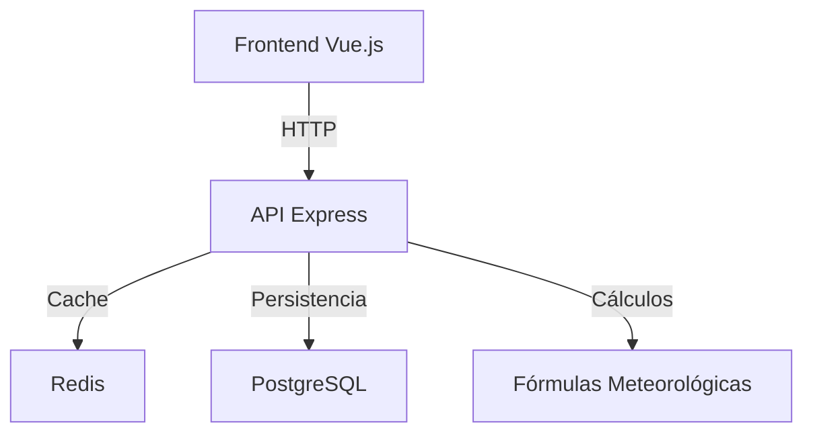

# Documentación del Backend - Invernadero IoT

## Arquitectura General
El backend utiliza una arquitectura REST API con Node.js/Express, con conexión a PostgreSQL para almacenamiento persistente y Redis para caching. El frontend (Vue.js) consume los endpoints a través de servicios específicos.



## Endpoints API

### 1. Datos en Tiempo Real
- **GET /api/latest/:table**
  - Obtiene el último registro de una tabla específica
  - Parámetros:
    - `table`: Nombre de tabla (temhum1, temhum2, calidad_agua, luxometro)
  - Cache: 30 segundos
  - Uso en frontend: `sensorService.getAmbientalSensor1()`

### 2. Datos Históricos
- **GET /api/history/:table**
  - Obtiene datos históricos paginados
  - Parámetros:
    - `table`: Nombre de tabla
    - `page`: Número de página (default: 1)
    - `limit`: Registros por página (default: 100, max: 500)
    - `from`: Fecha inicio (ISO format)
    - `to`: Fecha fin (ISO format)
  - Cache: 60 segundos
  - Uso en frontend: `sensorStore.fetchTemperatureHumidityData()`

### 3. Estadísticas Diarias
- **GET /api/stats/:table**
  - Resumen estadístico por día
  - Parámetros:
    - `table`: Nombre de tabla
    - `days`: Días a retroceder (default: 7)
  - Cache: 300 segundos
  - Uso en frontend: Componentes de gráficos

### 4. Datos para Gráficos
- **GET /api/chart/:table**
  - Datos agregados por hora para visualización
  - Parámetros:
    - `table`: Nombre de tabla
    - `hours`: Horas a retroceder (default: 24)
  - Cache: 180 segundos
  - Uso en frontend: `useSensorData()`

### 5. Estado del Sistema
- **GET /api/system-status**
  - Verifica conexión con PostgreSQL y Redis
  - Sin cache
  - Uso en frontend: Panel de administración

## Flujo de Datos

1. **Frontend** (Componente Vue) → Llama a composable (`useSensorData`)
2. **Composable** → Usa Store (`sensorStore`)
3. **Store** → Consume Service (`sensorService`)
4. **Service** → Hace request a API Express
5. **API**:
   - Verifica cache en Redis
   - Si no en cache, consulta PostgreSQL
   - Aplica fórmulas (ej: punto de rocío)
   - Guarda en cache si corresponde
   - Devuelve datos formateados

## Dependencias Clave

### Backend
- Express: Framework web
- PostgreSQL: Base de datos relacional
- Redis: Caching
- Moment: Manejo de fechas
- CORS: Middleware para Cross-Origin

### Frontend
- Axios: Cliente HTTP
- Pinia: Gestión de estado
- Vue 3: Framework frontend

## Ejemplo de Uso Completo

```javascript
// En componente Vue
import { useSensorData } from '@/composables/useSensorData'

const { temperatureHumidityData } = useSensorData()

// En store
fetchTemperatureHumidityData() {
  const data1 = await getAmbientalSensor1() // GET /api/latest/temhum1
  const data2 = await getAmbientalSensor2() // GET /api/latest/temhum2
}

// En service
getAmbientalSensor1() {
  return axios.get(`${API_BASE_URL}/latest/temhum1`)
}
```

## Manejo de Errores
- Cache fallback: Si Redis falla, se consulta directamente a PostgreSQL
- Timeouts: Frontend maneja timeouts de 10 segundos
- Datos demo: Si API no responde, se usan datos de demostración
- Logging detallado en backend y frontend

## Configuración
- Variables de entorno:
  - `REDIS_URL`: URL de conexión a Redis
  - `PG_URI`: URI de conexión a PostgreSQL
  - `PORT`: Puerto del servidor (default: 4000)
